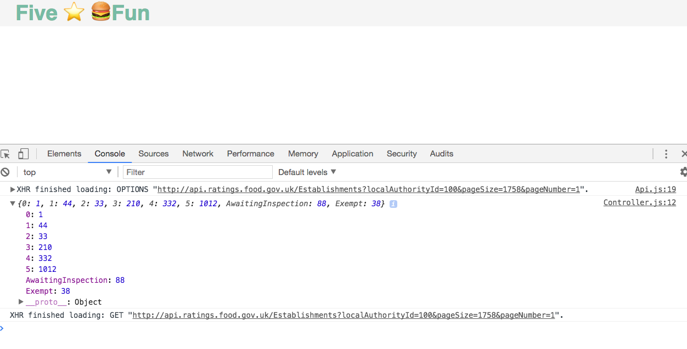

# Food Hygiene Ratings

## How to install and run:
Navigate to the repo:
```
cd path/to/repo
```
Update node modules:
```
npm install
```
(this shouldn't do much as there are no dependencies)

Run the tests:
```
open SpecRunner.html
```
Check they're green.

Open the file in your browser:
```
open index.html
```
Open the console: <CMD+ALT+J>

Admire the tiny console.log of data that represents a single arbitrary authority 🤞:



## Implementation

The challenge looked like it could be solved by building a single page web application with client-side javascript. 

## Approach
1. Attempt to make a client side javascript solution.
	- Make serveral different jQuery asynchronous get requests that are blocked as are 'Cross Origin'.
	- - Make XMLHttpRequest- it is blocked by the Same Origin policy.
	- Discover the Same Origin Policy and constraints on making a cross origin request from one domain to another, in this case a localhost to ratings.food.gov.uk
	- Spend _many_ hours looking for a solution.  Write a CORS request that specifies JSONP as the response JSON; it also fails.
	- Make a [StackOverflow question](https://stackoverflow.com/questions/46153430/what-are-my-options-to-avoid-a-cross-origin-request-being-blocked) to get help- advised to use a proxy(!)

2. Start to build a full-stack application, because of apparent need to have a server-side API call to Cross Origin Request blocking.
	- Serve static page with simple http-server
	- TDD promise that scoops authorities from API end point
	- Introduce Express framework, thinking that I can call my own server to call a function that makes an HTTP 'get' to the API end-point.

3. Realise I hadn't set the api version correctly in the HTTP request header, opening up clientside code option again.

4. Revert all server-side code and around spiked clientside XMLHttpRequest that is not blocked.

5. Write Rating constructor that sorts through the establishments, and adds scores to the scores-attribute.

6. Make Controller constructor to knit the two former classes together and output totals per (given) establishment

## Skills learnt throughout this test

- That the Same Origin Policy is key to security but also circumventable so that data is more easily shared and manipulated through APIs.

- That this is not necessarily straight forward!

- That servers can set Request Headers with 'Access-Control-Allow-Origin: *' to allow browsers to make CORS requests without blocking.

## Next Steps

- Currently, there is no frontend. I will build another Api-calling function that calls the authorities and builds a list from it, where the name is used to push the user id into the current Controller. 

- The Rating constructor requires another function that must calculate percentage of total

- Learn more about Fetchs and Promises to replace my wrapped xhr.

- TDD, TDD, TDD. Testing was difficult here. I wanted to spike to ensure I could make the code output what I needed, but it also meant that the functions became difficult to unit test. I am not happy with the limited tests and would spend more time exploring how to mock the api to make what tests there are less brittle and more meaningful.

## User Stories

```
As a user
I want to see how food hygiene ratings are distributed by percentage across as selected Local Authority
So that I can understand the profile of establishments in that authority.
```


